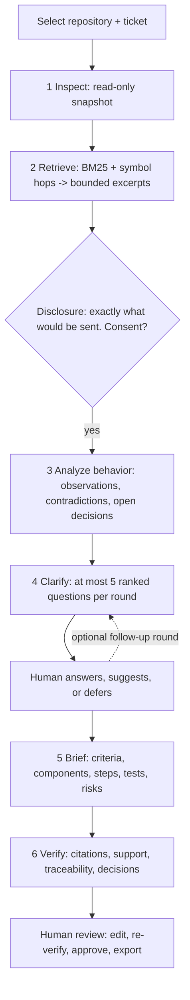

# ReadySpec

[](https://github.com/ns-0437/readyspec/actions/workflows/ci.yml)


**A repository-aware agent that turns a rough engineering ticket into an evidence-backed
implementation brief.** It reads the actual code, finds the decisions the ticket leaves open, asks
a few useful questions, and produces a plan an engineer can review and implement. Every statement
about existing behavior points at code; every proposed change connects to a requirement and a test.

> *"I built a repository-aware agent that helps engineers resolve ambiguity before implementation,
> with code-backed evidence and a benchmark against simpler approaches."*

> **Demonstration data.** The repositories under `fixtures/` are fictional code written for this
> project. They are not BetterMe's code or system.

**Contents:** [Status](#status) · [The problem](#the-problem) · [How it works](#how-it-works) ·
[Quick start](#quick-start) · [Configuration](#configuration) · [Safety model](#safety-model) ·
[Evaluation](#evaluation) · [Project layout](#project-layout) · [Development](#development) ·
[Roadmap](#roadmap) · [Limitations](#limitations)

## Status

| Works and is tested | Not done / not validated |
|---|---|
| Full flow: select repo, investigate, consent, clarify, brief, verify, edit, approve, export | **Anthropic has never run against a real API** (no key). Only tested against a local mock server. |
| **Gemini validated live** (`gemini-3.6-flash`): full staged pipeline completed end to end via `npm run smoke:live` and separately through the real browser UI — see [docs/decisions.md](docs/decisions.md) item 14 for the three real schema bugs that surfaced and were fixed from live errors, not guesses | **No model-quality benchmark result exists yet.** The harness, 30 cases (four fixture repositories, one now larger than the retrieval budget) and human rubric are ready; `npm run eval` against a real provider has not been run (needs dozens of calls) |
| Deterministic verifier: citations, support, traceability, decisions | Support check is lexical, not semantic |
| 162 tests, lint, typecheck, production build, CI | Retrieval is lexical; precision is 36-59% (36% on the one repo bigger than the retrieval budget) |
| Deterministic retrieval and static-checklist benchmark results | No screenshots or recording yet |

Without a key the app runs the **fixture provider**: scripted output for the demonstration ticket,
mechanical elsewhere. It is labelled in the UI, in the brief, in exports and in evaluation reports.
It is not a language model. Next steps: [docs/roadmap.md](docs/roadmap.md).

## The problem

A ticket describes the outcome someone wants. It rarely says how the code behaves today, which
components are involved, which product decisions are still open, or how the change will be tested.
The engineer rediscovers all of that, then guesses at the gaps or interrupts someone.

ReadySpec produces, for a given ticket and repository:

- the requested outcome, scope and explicit non-goals
- **existing behavior**, each statement tied to file and line evidence
- the decisions a human made, and the questions still open
- proposed acceptance criteria, each linked to evidence, affected components and a test
- an implementation sequence, test plan, risks and explicit assumptions

Content is always one of four kinds, in the schema, the verifier, the UI and the exports:

| Kind | Meaning | Rule |
|---|---|---|
| **Observed** | What the code does today | Must cite evidence; verified against the pinned snapshot |
| **Proposed** | A change, criterion, step or test | Never phrased as existing behavior |
| **Assumed** | An explicit, temporary assumption | Says what would replace it |
| **Unresolved** | A decision that needs a human | Never chosen silently; stays visible |

## How it works



Stages 1, 2 and 6 are plain code; only 3, 4 and 5 (and an optional support judge) call a model. Data
between stages is Zod-validated. Full design: [docs/architecture.md](docs/architecture.md).

**The signature interaction:** select an acceptance criterion and the evidence explorer shows,
together, the code excerpts it builds on (the rest dim), the affected components, its proposed
tests, the steps that deliver it, the decisions it relies on and any open question blocking it.

## Quick start

Requires Node 22.13+ (it uses the built-in `node:sqlite`).

```bash
git clone https://github.com/ns-0437/readyspec.git
cd readyspec
npm install
npm run dev
```

Open http://localhost:3000. The demonstration repository and ticket ("Let users pause
notifications while they are away.") are pre-filled. Click **Investigate repository**, review the
disclosure and consent, answer the questions, then open the brief and click an acceptance criterion.
A 90-second walkthrough is in [docs/demo.md](docs/demo.md).

### Use a real model

Set a key for **either** provider — Anthropic and Gemini are both supported behind the same
adapter interface (`LlmProvider`); if both keys are set, Anthropic is used unless
`READYSPEC_PROVIDER` says otherwise.

```bash
export ANTHROPIC_API_KEY=...   # or: export GEMINI_API_KEY=...  (GOOGLE_API_KEY also works)
npm run smoke:live             # first-contact check; see docs/live-validation.md
npm run dev
```

(PowerShell: `$env:ANTHROPIC_API_KEY = "..."` / `$env:GEMINI_API_KEY = "..."`)

The key stays server-side. When a real model is used, the excerpts listed on the consent screen
(and your ticket) are sent to that provider; nothing else from the repository is.

### Analyse your own repository

Add its parent directory to `READYSPEC_ALLOWED_ROOTS`. ReadySpec only reads it: it never executes
code, installs dependencies or writes to the repository.

## Configuration

Copy `.env.example` to `.env.local`. All optional.

| Variable | Default | Purpose |
|---|---|---|
| `ANTHROPIC_API_KEY` | unset | Enables the Anthropic provider |
| `GEMINI_API_KEY` (or `GOOGLE_API_KEY`) | unset | Enables the Gemini provider |
| `READYSPEC_PROVIDER` | `anthropic` if that key is set, else `gemini` if that key is set, else `fixture` | Force a specific provider |
| `READYSPEC_MODEL` | `claude-sonnet-5` (Anthropic) / `gemini-3.6-flash` (Gemini) | Model id for whichever provider is selected |
| `ANTHROPIC_BASE_URL` / `GEMINI_BASE_URL` | provider default | Override the API host (testing only) |
| `READYSPEC_MAX_CALLS` | 14 | Model calls per session (retries count) |
| `READYSPEC_MAX_INPUT_TOKENS` / `READYSPEC_MAX_OUTPUT_TOKENS` | 200000 / 60000 | Per-session token ceilings |
| `READYSPEC_MAX_COST_USD` | unset | Cost ceiling (needs prices) |
| `READYSPEC_PRICE_IN_PER_MTOK` / `READYSPEC_PRICE_OUT_PER_MTOK` | unset | USD per million tokens. Nothing is hard-coded, so cost shows as unknown until you set them |
| `READYSPEC_ALLOWED_ROOTS` | fixtures only | Extra repository roots (path-delimited) |
| `READYSPEC_DB` | `data/readyspec.db` | SQLite file |

## Safety model

- **Untrusted input.** Repository text and tickets are fenced as data in prompts, instruction-like
  text is flagged in the UI, and the model has no tools (regardless of provider), so text cannot
  trigger an action.
- **Confined reads.** Allowed roots only; symlinks and junctions are never followed; secrets, binaries,
  generated, minified and oversized files are excluded; secret-bearing content is discarded.
- **Consent.** No model call happens before you have seen the exact excerpts and agreed.
- **Bounded.** Per-session ceilings on calls, tokens and cost; bounded retries; every call cancellable;
  failures keep evidence and answers and can resume.
- **Secrets.** Credentials stay server-side and are redacted from logs and errors.
- **Human in charge.** Recorded answers override the model; approval needs a named reviewer, passing
  verification for the current revision, and acknowledgement of any open questions.

## Evaluation

Thirty hand-authored tickets over four small fictional repositories (TypeScript and Python) — one of them,
`helpdesk-platform`, deliberately larger than the retrieval budget so a single prompt actually gets truncated —
thirteen held out in two cohorts, compared across a static checklist, a single prompt and the staged workflow.

| What was actually measured (deterministic) | Development (17) | — helpdesk-platform alone (4) | Held-out v2 (6, clean) |
|---|---|---|---|
| Staged retrieval: required-file recall | 97% | 100% | 100% |
| Staged retrieval: precision | 52% | 36% | 48% |
| Static checklist: critical ambiguities asked | 3% | 0% |

The model-dependent comparison (evidence correctness, ambiguity detection, unnecessary questions,
human correction effort, latency, cost) **has not been measured**, so no claim that ReadySpec beats a
single prompt is made. Read [evals/REPORT.md](evals/REPORT.md) for the failures, and
[docs/evaluation.md](docs/evaluation.md) for method and threats to validity. Human rubric:
[evals/rubrics/human-rubric.md](evals/rubrics/human-rubric.md).

## Project layout

```
src/shared        Zod schemas and pure helpers (trace, edit ops, redaction)
src/server/
  repository      snapshot, safe file access, symbols, search, evidence
  llm             provider adapters (Anthropic, Gemini, fixture), prompts, budgets, structured generation
  workflow        stages, verifier, session service, export
  persistence     SQLite store
src/app/api       thin route handlers
src/components    UI
fixtures/         demo-repository and two evaluation repositories (fictional)
evals/            cases, rubric, runner, results, report
scripts/          live-smoke.ts
tests/            Vitest suites
docs/             product, architecture, decisions, evaluation, live-validation, roadmap, demo, plan
CLAUDE.md         guide for future coding sessions
```

## Development

```bash
npm run dev            # development server
npm run build          # production build
npm run lint           # eslint
npm run typecheck      # tsc (app and fixtures)
npm test               # Vitest
npm run test:fixtures  # the fixture repositories' own tests (node --test)
npm run check          # lint + typecheck + test
npm run eval -- --provider fixture --set dev            # benchmark; add --repeat N for variance
npm run smoke:live                                      # needs ANTHROPIC_API_KEY or GEMINI_API_KEY
```

CI runs lint, typecheck, tests, fixture tests, the deterministic benchmark and the build on every push.

## Roadmap

1. Validate the live path and finish the benchmark ([docs/live-validation.md](docs/live-validation.md)).
2. Fix what that exposes; improve retrieval precision and the vocabulary gap.
3. A benchmark on repositories larger than the context budget.
4. Polish: revision diffs, inline line highlighting, screenshots and a recording.

Details and reasoning: [docs/roadmap.md](docs/roadmap.md). Decisions and measured trade-offs:
[docs/decisions.md](docs/decisions.md).

## Limitations

Single-user local tool (no authentication); one job per session, in-process; snapshot creation is
synchronous and capped at 1500 files / 12 MB; symbol extraction is regex-based; the `node:sqlite` module prints an experimental warning. Snapshots store the
contents of every readable file in the local SQLite file (`data/`, git-ignored); deleting a session
removes them unless another session pins the same snapshot.
