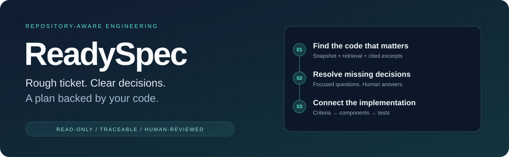
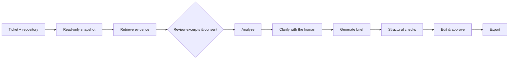

<div align="center">



**Turn an ambiguous ticket into an implementation brief you can inspect.**

[](https://github.com/ns-0437/readyspec/actions/workflows/ci.yml)
[](https://github.com/ns-0437/readyspec/actions/workflows/retrieval-regression.yml)


[**Launch interactive demo ↗**](https://ns-0437.github.io/readyspec/) · [Try locally](#try-locally) · [Under the hood](#under-the-hood) · [What is measured](#what-is-measured)

</div>

ReadySpec reads a repository, finds the decisions a ticket leaves open, asks focused questions,
and builds a brief with code citations. Select an acceptance criterion in the app to trace it
to evidence, components, tests, and the decisions behind it.

**[Try the hosted demo](https://ns-0437.github.io/readyspec/)** — explore fixture code, make three
product decisions, edit the resulting criteria, and export a reviewed brief. No account or API key.
The Pages demo is scripted and runs entirely in your browser; use the local app for real repositories
and model calls. [How the demo works →](docs/pages-demo.md)

> **Project status:** the end-to-end workflow is built. The default demo is a clearly labelled,
> scripted fixture provider and needs no API key. **Whether staged generation produces better
> briefs than a single prompt is still unproven.** [Validation record →](docs/live-validation.md)

## From ticket to brief

> “Let users pause notifications while they are away.”

| Before implementation | What ReadySpec puts in front of the engineer |
| :--- | :--- |
| **What does the code already do?** | Observed behavior linked to excerpts from an immutable repository snapshot. |
| **Which decisions are missing?** | Up to five questions per round, with the reason each matters. |
| **What exactly should change?** | Scope, acceptance criteria, affected components, implementation steps, and proposed tests. |
| **Can I inspect and challenge it?** | A trace inspector, editable brief, visible open questions, and human approval before export. |

<details>
<summary><b>▸ Open the notification-pause walkthrough</b></summary>

This is an illustrative walkthrough using the fictional demo repository, not a captured model
result or any company's internal code.

1. **Find existing behavior.** `decideDelivery()` allows security notifications before checking
   category preferences. [Read the source](fixtures/demo-repository/src/notifications/dispatcher.ts#L13-L17).
2. **Expose the decision.** Should a pause also suppress security notifications? The ticket does
   not say; ReadySpec should ask rather than silently choose.
3. **Record the human answer.** For this example: “Keep security notifications eligible for
   delivery during a pause.” This becomes a decision, not a model-invented fact.
4. **Propose a criterion.** While a pause is active, ordinary notifications are skipped;
   security notifications retain their existing delivery eligibility.
5. **Connect a test.** Add pause-boundary and security-exception cases alongside the existing
   [dispatcher tests](fixtures/demo-repository/tests/dispatcher.test.ts), then inspect the links
   from the criterion to the component, evidence, and test proposal.

**Export:** Markdown for a design discussion, JSON for structured handoff, or a GitHub-issue
checklist. These are downloadable outputs; ReadySpec does not post issues for you.

The links above navigate this repository. In the app, evidence additionally carries a line range
and SHA-256 hash tied to the session's snapshot.

</details>

## Try locally

Requires **Node.js 22.13 or later** and npm.

```bash
git clone https://github.com/ns-0437/readyspec.git
cd readyspec
npm ci
npm run dev
```

Open **http://localhost:3000**. Select the bundled demo repository, enter the notification-pause
ticket above, investigate, review the excerpts, then continue through questions and the brief.
With no provider keys configured, everything uses the scripted fixture provider.

<details>
<summary><b>▸ Already have API keys configured? Force a key-free demo</b></summary>

PowerShell:

```powershell
$env:READYSPEC_PROVIDER = "fixture"
npm run dev
```

macOS / Linux:

```bash
READYSPEC_PROVIDER=fixture npm run dev
```

</details>

<details>
<summary><b>▸ Connect a real model or your own repository</b></summary>

Copy [`.env.example`](.env.example) to `.env.local`. Set `READYSPEC_PROVIDER` to `anthropic`,
`gemini`, or `groq`, and add the corresponding API key. `READYSPEC_MODEL` overrides the model;
choose a model available to your account. Restart the server after configuration changes.

Add local repository directories to `READYSPEC_ALLOWED_ROOTS` (separate with `;` on Windows,
`:` elsewhere). Bundled fixtures are always allowed. The application reads snapshots; it does
not execute the inspected repository or edit its files.

Optional call, token, and dollar ceilings are documented in `.env.example`. A dollar ceiling
requires both input and output prices. Token estimates and conservative failure reservations
are guards, not a guarantee of the provider's final bill.

`npm run smoke:live` exercises the configured live provider and consumes its quota. Read the
[live-validation instructions](docs/live-validation.md) and [evaluation guide](docs/evaluation.md)
before running paid calls. Never commit `.env.local`.

</details>

## Under the hood


```mermaid
flowchart LR
    A[Ticket + repository] --> B[Read-only snapshot]
    B --> C[Retrieve evidence]
    C --> D{Review excerpts & consent}
    D --> E[Analyze]
    E --> F[Clarify with the human]
    F --> G[Generate brief]
    G --> H[Structural checks]
    H --> I[Edit & approve]
    I --> J[Export]
```

Retrieval uses **BM25, symbol hops, and test-file pairing**. It runs locally before any model
call. Follow-up answers can retrieve additional excerpts; sending new excerpts requires fresh consent.

| Layer | Implementation |
| :--- | :--- |
| Interface | Next.js App Router, React, TypeScript |
| Contracts | Zod at stage, API, and persistence boundaries |
| Evidence | Filtered snapshots, deterministic retrieval, file/line/hash citations |
| Generation | Anthropic, Gemini, and Groq adapters behind one plain-fetch interface |
| Persistence | Local SQLite with resumable sessions and usage accounting |
| Evaluation | Same-evidence baseline, durable per-result artifacts, run-wide budgets |

<details>
<summary><b>▸ Explore the code map</b></summary>

```text
src/
  app/                  Pages and thin API handlers
  components/           Session UI, brief editor, trace inspector
  shared/               Schemas and pure trace/edit/redaction helpers
  server/
    repository/         Safe reads, snapshots, search, evidence
    llm/                Providers, prompts, structured output, budgets
    workflow/           Stage orchestration, verification, export
    persistence/        SQLite storage and migrations
evals/                  Cases, baselines, scoring, pilot planning
fixtures/               Fictional repositories for demos and evaluation
tests/                  Contract, safety, workflow, and regression tests
docs/                   Architecture, decisions, evaluation, demo script
```

Start with [architecture](docs/architecture.md), the [engineering decisions](docs/decisions.md),
or [CLAUDE.md](CLAUDE.md) for working rules and the detailed code map.

</details>

## Keep facts and proposals distinct

| Content kind | Meaning |
| :--- | :--- |
| **Observed** | A claim about existing code; requires evidence. |
| **Proposed** | A change, criterion, step, or test to implement. |
| **Assumed** | An explicit temporary assumption that can be replaced. |
| **Unresolved** | A decision still waiting for a human answer. |

**A valid citation does not prove a claim is true.** Structural checks validate citations,
identifier matches, and links between brief items. A sentence with the correct identifiers but
the wrong meaning can still pass. Human review remains the correctness gate.

Repository text is untrusted data. File exclusions and redaction reduce exposure but cannot
guarantee that arbitrary source code contains no secrets. This is a local, single-user tool
without authentication; its SQLite snapshots contain repository content.

## What is measured

| Question | Evidence today |
| :--- | :--- |
| Does retrieval find the expected files? | **97.1% recall / 52.5% precision** on 17 hand-authored development cases; **0.59 distractor files per case**. Small fixture set, not a production claim. |
| Does the live pipeline run? | Gemini validated; Groq's structured call validated, with staged execution limited by the tested account's quota. Anthropic remains mock-server tested. |
| Does staged generation beat a single prompt? | **Not measured with live models yet.** Both systems now receive the same retrieved evidence. |
| Is verification semantic? | **No.** Citation validity and identifier matching are structural checks. |
| Is cost accounting exact billing? | **No.** Reported usage is separated from conservative estimates for failed requests. |

[Read the evaluation report](evals/REPORT.md) · [Inspect the human rubric](evals/rubrics/human-rubric.md)
· [See the next experiment](docs/roadmap.md)

Reproduce the retrieval check or inspect a pilot without model calls:

```bash
npm run eval:regression
npm run eval -- --provider fixture --pilot --profile compact --dry-run
```

The compact profile uses smaller output allowances; its effect on quality is unvalidated.
Held-out quality evaluation is reserved for a code freeze. See the
[evaluation guide](docs/evaluation.md) for budgets, repetitions, saved results, and cohort rules.

## Development

```bash
npm run check           # lint, typecheck, unit/integration tests
npm run test:fixtures   # the fictional repositories' own tests
npm run eval:regression # deterministic retrieval check
npm run build          # production build
```

**Current boundaries:** one repository per session, regex-based symbol extraction, synchronous
snapshots capped at 1,500 files / 12 MB, and in-process background work. Local SQLite requires
persistent storage. The full server application needs a server host; the separate browser-only
[demo frontend](docs/pages-demo.md) is published on GitHub Pages.

<div align="center">

**Find the evidence. Resolve the ambiguity. Review the plan.**

[90-second demo script](docs/demo.md) · [Architecture](docs/architecture.md) · [Roadmap](docs/roadmap.md)

</div>
